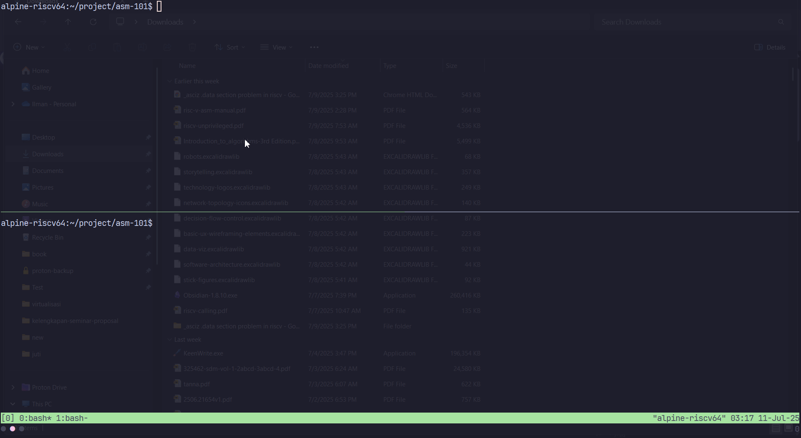

# TCP SOCKET IN RISC-V ASSEMBLY/GAS (RV64I)



This project is a recreation of Alexey Kutepov's (a.k.a Tsoding) livestream [Web in Native Assembly (Linux x86_64)](https://youtu.be/b-q4QBy52AA?si=G1P-21p3YN_ENE5s), reimplemented in RISC-V assembly. It's also my first exploration of RISC-V assembly programming. 

Compilation steps and learning resources attached bellow:

In RISC-V OS with GAS assembler and linker:
```make
make # build
make clean # clean

```
for cross compilation:
```make
make AS=[as-path] LD=[ld-path]
```

Learning resources:
- [RISC-V Linux syscall table][1]
- [The dark side of RISC-V linker relaxation][2]
- [Global Pointer][3]
- [RISC-V Assembler Reference][4]
- [RISC-V Instruction Set Reverence][5]
- [Correct way to add labels for RISC-V data section][6]
- [RISC-V Calling Convention][7]
- [Linux kernel system calls for all architectures][8]
- [RISC-V Assembly Language][9]
- [Easy RISC-V][10]

OS & Toolchains (optional):
- [Cross-compiler][t1]
- [Alphine Linux RISC-V 64][t2]

[1]: https://jborza.com/post/2021-05-11-riscv-linux-syscalls/
[2]: https://maskray.me/blog/2021-03-14-the-dark-side-of-riscv-linker-relaxation#global-pointer-relaxation
[3]: https://www.five-embeddev.com//quickref/global_pointer.html
[4]: https://michaeljclark.github.io/asm.html
[5]: https://michaeljclark.github.io/isa
[6]: https://stackoverflow.com/questions/77797870/correct-way-to-add-labels-for-riscv-data-section-so-assembler-can-pick-up
[7]: https://riscv.org/wp-content/uploads/2024/12/riscv-calling.pdf
[8]: https://gpages.juszkiewicz.com.pl/syscalls-table/syscalls.html
[9]: https://shakti.org.in/docs/risc-v-asm-manual.pdf
[10]: https://dramforever.github.io/easyriscv/

[t1]: https://toolchains.bootlin.com/
[t2]: https://github.com/starnight/build-image


